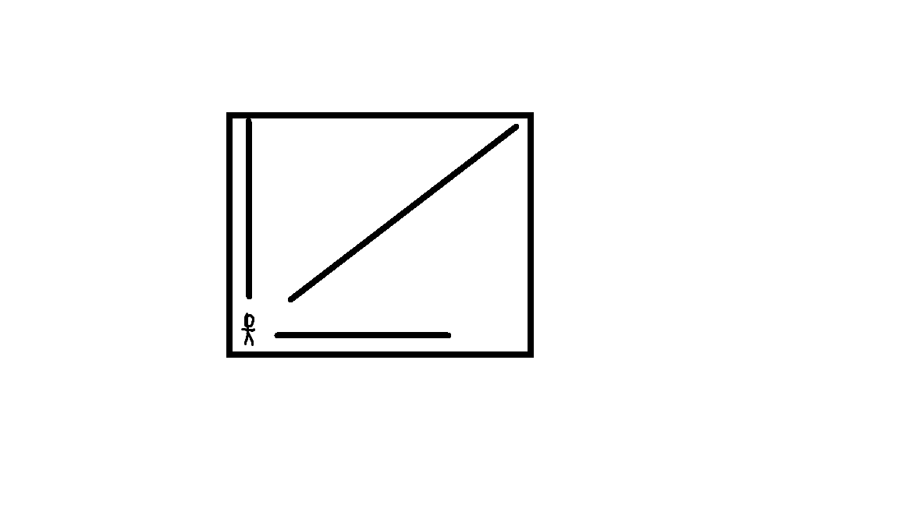

# PHASER 

El juego original de Phaser solo tiene una bala, esta bala se dirige de manera horizontal de 
derecha a izquierda con lo que el jugador puede evitar saltando.

## AGREGANDO DOS BALAS MAS AL JUEGO
Ahora se agregaran dos balas más, una que caera de manera vertical al inicio del juego
Y otra que vendra de manera diagonal 

